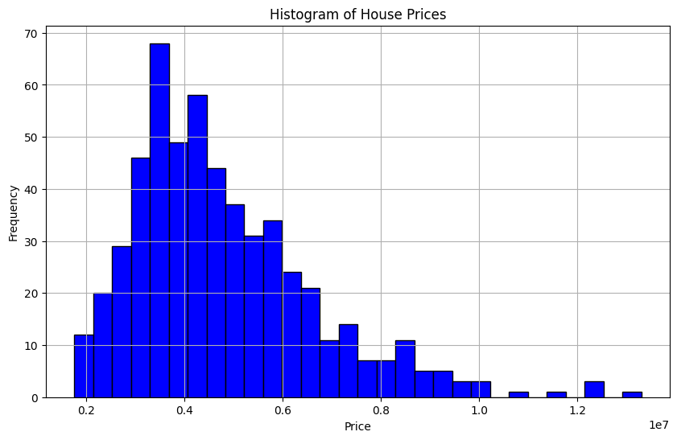
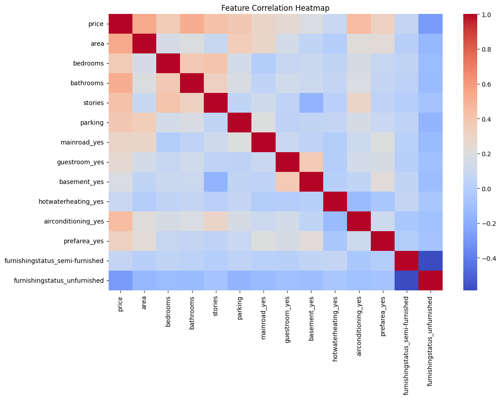
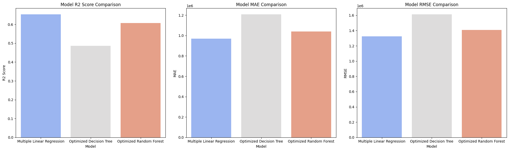
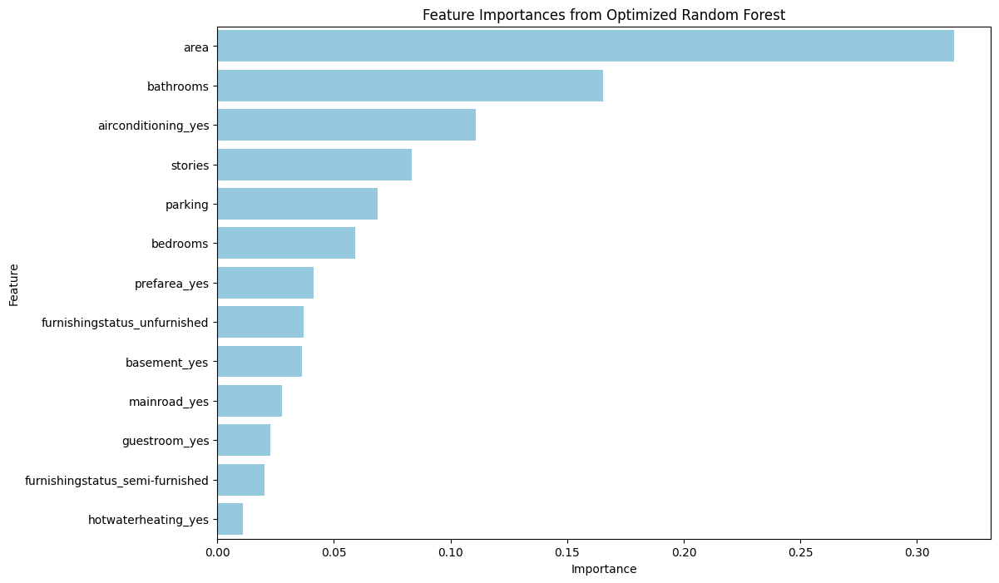

## 💼 **Author**
**Anthony Sergo**

- GitHub: https://github.com/Tony-Magabush28
- LinkedIn: www.linkedin.com/in/anthony-sergo1 
- Email: anthonysergo9@gmail.com
- Portfolio: https://my-flask-portfolio.onrender.com/

---

## 🏠 Housing Price Prediction
This project implements an end-to-end machine learning pipeline to predict housing prices using multiple regression models. It includes data preprocessing, model training, hyperparameter optimization, model evaluation, and visualization.

---

## 📋 Project Overview
The goal is to build regression models that can accurately predict house prices based on various features such as:

- Area
- Number of Bedrooms & Bathrooms
- Presence of amenities (Air Conditioning, Guest Room, Basement, etc.)
- Road proximity and furnishing status

---

## Models used:

- Multiple Linear Regression
- Decision Tree Regressor (with Grid Search Optimization)
- Random Forest Regressor (with Randomized Search Optimization)

---

## 📂 Dataset
- File: Housing.csv
- Type: CSV (Comma Separated Values)
- Content: Housing data containing both numerical and categorical variables.

---

## 🧑‍💻 Project Workflow
1. ## Data Preprocessing
- Handled categorical variables via one-hot encoding.
- Split the dataset into training and testing sets (80% / 20% split).
- Scaled features using StandardScaler (for Linear Regression).

2. ## Exploratory Data Analysis
- Computed summary statistics (mean, median, variance, etc.).
- Visualized distribution of house prices with histograms.
- Generated a heatmap to analyze feature correlations.

3. ## Modeling & Hyperparameter Tuning
## Multiple Linear Regression (with scaling pipeline)
## Decision Tree Regressor:

• Optimized using GridSearchCV for:

- max_depth
- min_samples_split
- min_samples_leaf

## Random Forest Regressor:
• Optimized using RandomizedSearchCV for:

- n_estimators
- max_depth
- min_samples_split
- min_samples_leaf
- max_features

4. ## Model Evaluation
• Evaluated models on:

- R² Score
- Mean Absolute Error (MAE)
- Root Mean Squared Error (RMSE)

5. ## Model Comparison & Visualization

- Bar plots for comparing model performance.
- Feature importance plot from the optimized Random Forest model.
- Residual analysis plot to check model errors.

---

## 📌 Key Features & Technologies
- Python

• Libraries:

- pandas
- numpy
- matplotlib
- seaborn
- scikit-learn (for modeling, tuning, and metrics)

---

## 📊 Visualizations

### Histogram of House Prices


### Correlation Heatmap


### Model Comparison Summary


### Feature Importances (Random Forest)


### Residual Plot for Random Forest


---

## 📊 Results Summary

  **Summary Statistics** 

| Metric              | Value (₵)             |
|---------------------|-----------------------|
| **Mean Price**      | ₵4,766,729.25         |
| **Median Price**    | ₵4,340,000.00         |
| **Mode Price**      | ₵3,500,000.00         |
| **Variance**        | ₵3,498,544,355,820.57 |
| **Standard Deviation** | ₵1,870,439.62       |

The analysis of house prices from the dataset provided the following insights:

- Mean Price: ₵4,766,729
The average house price in the dataset is approximately ₵4.77 million.

- Median Price: ₵4,340,000
The median price (the midpoint of the dataset) is ₵4.34 million, meaning half of the houses cost less than this amount and half cost more.

- Mode Price: ₵3,500,000
The most common house price is ₵3.5 million, indicating this is the price that appears most frequently.

- Variance: ₵3,498,544,355,820.57
The high variance shows that house prices vary significantly within the dataset.

- Standard Deviation: ₵1,870,439
The average deviation from the mean price is about ₵1.87 million, indicating high variability in the housing market.

## 📌 Key Insights:
The mean price is higher than the median, suggesting a right-skewed distribution (a few very high-priced houses increase the average).

The high standard deviation and variance suggest large differences in house prices, likely due to factors such as property size, amenities, location, and other features.

---

### 📈 Multiple Linear Regression Evaluation
| Metric                               | Value (₵)                     |
|--------------------------------------|-------------------------------|
| **R² Score**                         | 0.653                         |
| **Mean Absolute Error (MAE)**        | ₵970,043.40                   |
| **Mean Squared Error (MSE)**         | ₵1,754,318,687,330.67         |
| **Root Mean Squared Error (RMSE)**   | ₵1,324,506.96                 |

#### ✅ Insights:
- **R² Score (0.653):** The model explains about **65%** of the changes in house prices.
- **MAE (~₵970k):** On average, predictions are off by about **₵970,000** from the actual price.
- **RMSE (~₵1.32M):** The typical prediction error is around **₵1.32 million**.
- This means while the model works fairly well, house prices still vary a lot, which is common in real estate.

---

## 🌳 Optimized Decision Tree Evaluation: 
**Best Parameters:** {'max_depth': 5, 'min_samples_leaf': 4, 'min_samples_split': 2}

| Metric                             | Value (₵)             |
| ---------------------------------- | --------------------- |
| **R² Score**                       | 0.486                 |
| **Mean Absolute Error (MAE)**      | ₵1,207,548.55         |
| **Mean Squared Error (MSE)**       | ₵2,597,777,774,930.72 |
| **Root Mean Squared Error (RMSE)** | ₵1,611,762.32         |

- **max_depth:** 5 → Limits the depth of the tree to prevent overfitting.
- **min_samples_leaf:** 4 → Each leaf has at least 4 data points.
- **min_samples_split:** 2 → Minimum 2 samples to split a node.

## ✅ Insights:
- **R² Score (0.486):** The model explains about 48.6% of the variation in house prices.

- **MAE (₵1.21M):8** On average, predictions are off by about ₵1.21 million.

- **RMSE (₵1.61M):** The typical prediction error is around ₵1.61 million.

- Although the model is optimized, its performance is lower than Linear Regression, likely because Decision Trees are more prone to underfitting on this dataset with limited depth.

---

### 🌲 Optimized Random Forest Evaluation
**Best Parameters:**  
{
    'n_estimators': 200,
    'min_samples_split': 2,
    'min_samples_leaf': 2,
    'max_features': 'sqrt',
    'max_depth': None
}

| Metric                             | Value (₵)             |
| ---------------------------------- | --------------------- |
| **R² Score**                       | 0.607                 |
| **Mean Absolute Error (MAE)**      | ₵1,039,795.96         |
| **Mean Squared Error (MSE)**       | ₵1,987,689,637,112.05 |
| **Root Mean Squared Error (RMSE)** | ₵1,409,854.47         |

- 200 trees (n_estimators)
- Automatically selecting features per split (`max_features='sqrt'`)
- No depth limit (`max_depth=None`), allowing full growth as needed.
- Controls to prevent overfitting via `min_samples_split` and `min_samples_leaf`.

### ✅ Insights:
- Random Forest provides **balanced and stable predictions**.
- It reduces overfitting compared to Decision Trees by combining multiple trees.
- It performed better here than the Decision Tree, with good accuracy and acceptable errors.

---

### 📊 Model Comparison Summary

| Model                        | R² Score | Mean Absolute Error (MAE) | Root Mean Squared Error (RMSE) |
|------------------------------|----------|---------------------------|--------------------------------|
| **Multiple Linear Regression** | 0.653    | ₵970,043.40                | ₵1,324,507.00                  |
| **Optimized Decision Tree**    | 0.486    | ₵1,207,548.55              | ₵1,611,762.00                  |
| **Optimized Random Forest**    | 0.607    | ₵1,039,795.96              | ₵1,409,854.00                  |

#### ✅ Quick Insights:
- **Multiple Linear Regression** achieved the highest R² score (**0.653**), meaning it explained the most variation in house prices.
- **Random Forest** had **lower errors** (MAE & RMSE) compared to Decision Tree, with balanced performance.
- **Decision Tree** was the least accurate here but still provides interpretable results.

---

## ✅ Conclusion:
- This project shows how different models can predict house prices with varying accuracy.

- The choice of the best model depends on whether explainability (Decision Tree), simplicity (Linear Regression), or prediction accuracy (Random Forest) is the priority.

---

## ✅ Key Features
- Automated machine learning workflow with pipelines.
- Hyperparameter tuning using Grid Search and Randomized Search.
- Robust model evaluation and comparison.
- Insightful visualizations for deeper analysis.

---

## 🚀 **How to Run This Project**
```bash
1. Clone this repo
2. Install dependencies: pip install -r requirements.txt
3. Run the notebook or script

---

## ⚠️ Disclaimer
This project is for educational and demonstration purposes only. The dataset used may not represent current market conditions.

---

## 🤝 Acknowledgments
Thanks to the open-source community and the creators of Python libraries used.
🔗 [Connect with me on LinkedIn](https://www.linkedin.com/in/anthony-sergo1)  
💬 Feel free to explore, star ⭐, or fork 🍴 this repository!